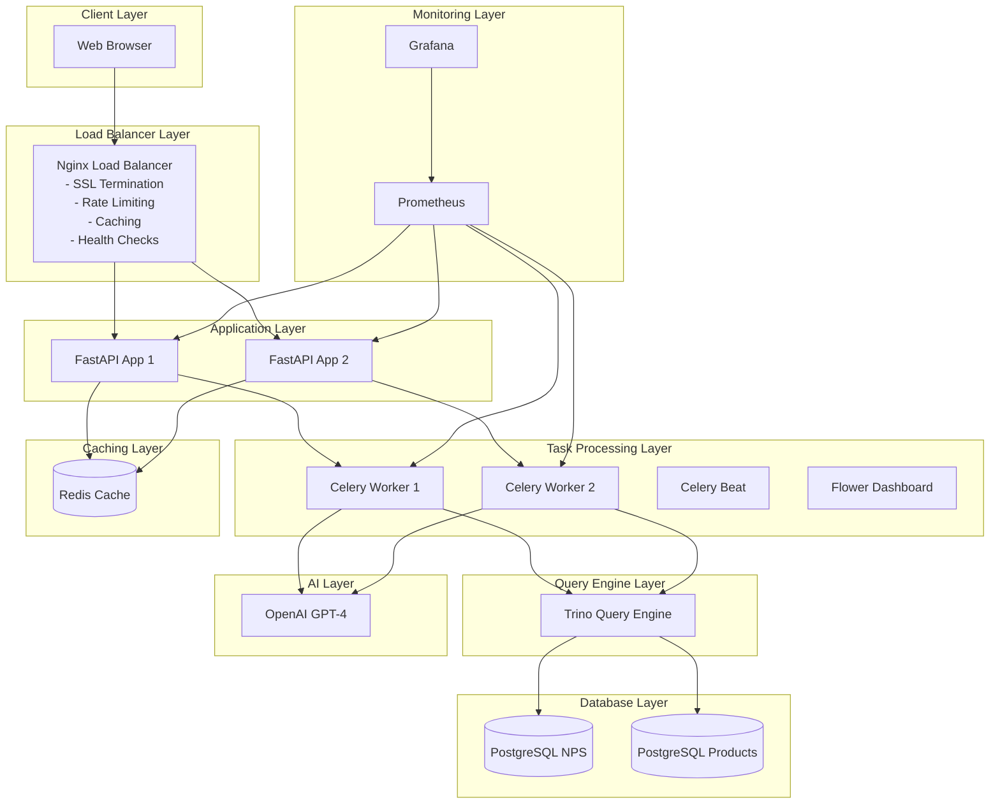

# SQL Chat Agent - Natural Language Database Interface

A production-ready natural language SQL chat agent that connects to multiple PostgreSQL databases via Trino, featuring memory capabilities, async processing, intelligent query correction, and production-grade monitoring with Prometheus and Grafana.


## 🌟 Features

### Core Capabilities
- Natural language to SQL conversion using LLM (GPT-4)
- Multi-database support through Trino query engine
- Cross-database queries and joins
- Memory-enabled conversations for context retention
- Automatic query correction using LangGraph
- Follow-up suggestions based on conversation context
- Real-time chat interface

### Production Features
- Horizontal scaling with Nginx load balancer
- Redis caching for improved performance
- Celery for async task processing
- Comprehensive monitoring with Prometheus and Grafana
- Health checks and detailed metrics
- Rate limiting and security measures
- Docker containerization for easy deployment

## 🏗 Architecture

The system follows a microservices architecture with the following components:



### Component Details

- **Frontend**: React-based chat interface with session management
- **Load Balancer**: Nginx with health checks and SSL termination
- **Backend**: FastAPI with LangChain and LangGraph
- **Query Engine**: Trino for cross-database queries
- **Databases**: Two PostgreSQL instances (NPS and Products)
- **Cache**: Redis for conversation memory and results
- **Task Queue**: Celery with Redis broker
- **Monitoring**: Prometheus + Grafana stack
- **AI**: OpenAI GPT-4 API for natural language processing

## 🚀 Key Features

### 1. Memory-Enabled Conversations
- Redis-backed conversation history
- Context-aware query processing
- Session management with 24-hour TTL
- Persistent chat history across sessions

### 2. Intelligent Query Correction
- LangGraph-powered error detection and correction
- Automatic retry mechanism with up to 3 attempts
- Schema-aware query validation
- Context-sensitive error handling

### 3. Production-Ready Infrastructure
- Horizontal scaling with multiple app instances
- Load balancing with Nginx
- Health checks and monitoring
- Automatic failover and recovery

### 4. Comprehensive Monitoring
- Real-time metrics with Prometheus
- Custom Grafana dashboards
- Query performance tracking
- System resource monitoring
- Alert configuration for critical issues

### 5. Performance Optimization
- Query result caching (5-minute TTL)
- Schema caching (1-hour TTL)
- Connection pooling
- Async task processing

## 📋 Prerequisites

- Docker Desktop (version 20.10 or higher)
- Docker Compose (version 2.0 or higher)
- Git
- OpenAI API key
- At least 4GB RAM
- 10GB disk space

## 🔧 Quick Start

### Initial Setup

1. **Clone the repository:**
```bash
git clone https://github.com/arun1934/talk-to-multiple-databases
cd sql-chat-agent
```

2. **Create the environment file:**
```bash
cp .env.example .env
```

3. **Configure your environment variables:**
```env
# Required
OPENAI_API_KEY=your_openai_api_key_here

# Optional (defaults provided)
OPENAI_MODEL=gpt-4o-mini
REDIS_URL=redis://redis:6379/0
CELERY_BROKER_URL=redis://redis:6379/1
CELERY_RESULT_BACKEND=redis://redis:6379/2
GRAFANA_PASSWORD=admin
```

4. **Start all services:**
```bash
docker-compose up --build -d
```

5. **Verify services are running:**
```bash
docker-compose ps
```

### Accessing the Application

Once all services are running, you can access:

| Service | URL | Description |
|---------|-----|-------------|
| Web Interface | http://localhost | Main chat interface |
| Grafana Dashboard | http://localhost:3000 | Monitoring dashboards (admin/admin) |
| Prometheus | http://localhost:9090 | Metrics interface |
| Flower Dashboard | http://localhost:5555 | Celery task monitoring |
| Trino UI | http://localhost:8080 | Query execution monitoring |

## 💾 Database Schema

### NPS Database (nps_db)
```sql
CREATE TABLE nps_feedback (
    feedback_id SERIAL PRIMARY KEY,
    product_id INTEGER,
    rating INTEGER CHECK (rating BETWEEN 1 AND 5),
    comment TEXT,
    category VARCHAR(50),
    subcategory VARCHAR(50),
    region VARCHAR(50),
    carpenter_name VARCHAR(100),
    driver_name VARCHAR(100),
    created_at TIMESTAMP DEFAULT CURRENT_TIMESTAMP
);
```

### Products Database (products_db)
```sql
CREATE TABLE products (
    product_id SERIAL PRIMARY KEY,
    product_name VARCHAR(200),
    description TEXT,
    price DECIMAL(10,2),
    sku VARCHAR(50),
    created_at TIMESTAMP DEFAULT CURRENT_TIMESTAMP
);
```

## 🎯 Usage Guide

### Basic Usage

1. Open http://localhost in your browser
2. Type questions in natural language
3. View the generated SQL and results
4. Use follow-up suggestions for deeper analysis

### Example Queries

```
"What is the average rating by product category?"
"Show me all furniture deliveries with ratings below 3 in Dubai"
"Which carpenter has the highest average rating?"
"What are the top complaints about dining tables?"
"Compare delivery satisfaction between regions"
```

### API Usage

```bash
# Submit a query
curl -X POST http://localhost/api/query \
  -H "Content-Type: application/json" \
  -d '{"query": "What is the average rating?", "session_id": "optional-session-id"}'

# Get conversation history
curl http://localhost/api/history/{session_id}

# Check system health
curl http://localhost/health/detailed
```

## 📊 Monitoring & Metrics

### Grafana Dashboards

Access at http://localhost:3000 (admin/admin)

Available metrics:
- Query rate and latency
- Cache hit ratio
- Error rates
- System resources
- Celery task performance

### Key Metrics

| Metric | Description | Query |
|--------|-------------|-------|
| Query Rate | Requests per second | `rate(sql_queries_total[5m])` |
| Error Rate | Errors per second | `rate(application_errors_total[5m])` |
| P95 Latency | 95th percentile response time | `histogram_quantile(0.95, rate(sql_query_duration_seconds_bucket[5m]))` |
| Cache Hit Ratio | Percentage of cache hits | `rate(cache_hits_total[5m]) / (rate(cache_hits_total[5m]) + rate(cache_misses_total[5m]))` |

### Alerts

Pre-configured alerts include:
- High error rate (>0.1 errors/sec)
- High API latency (>5 seconds)
- Database connection failures
- Low cache hit ratio (<50%)
- High CPU/memory usage

## 🔄 Scaling

### Horizontal Scaling

Add more application instances:
```yaml
# docker-compose.yml
app3:
  build: .
  environment:
    - INSTANCE_ID=3
  # ... other settings
```

Add more workers:
```yaml
celery-worker3:
  build: .
  command: celery -A app.tasks.celery_app worker
  # ... other settings
```

### Performance Tuning

1. **Query Optimization**
   - Monitor slow queries in Trino UI
   - Add appropriate indexes
   - Adjust cache TTL values

2. **Resource Management**
   - Configure Redis maxmemory
   - Adjust worker concurrency
   - Set appropriate connection pool sizes

## 🛠 Development

### Project Structure
```
sql-chat-agent/
├── app/
│   ├── agents/              # LLM and SQL agents
│   ├── graphs/              # LangGraph workflows  
│   ├── services/            # Business logic
│   ├── tasks.py            # Celery tasks
│   └── main.py             # FastAPI application
├── nginx/                   # Load balancer config
├── monitoring/              # Prometheus/Grafana configs
├── sql/                     # Database schemas
├── static/                  # Frontend assets
├── trino/                   # Trino configuration
└── docker-compose.yml       # Service orchestration
```

### Running Tests
```bash
# Run unit tests
docker-compose run app pytest tests/

# Run integration tests
docker-compose run app pytest tests/integration/
```

## 🔒 Security

### Best Practices
1. Keep API keys secure and rotate regularly
2. Use HTTPS in production
3. Implement rate limiting
4. Sanitize user inputs
5. Use read-only database users where possible
6. Keep dependencies updated

### Environment Variables
- Never commit `.env` files
- Use secrets management in production
- Separate development and production keys

## 🐛 Troubleshooting

### Common Issues

1. **Connection Refused**
   ```bash
   # Check service status
   docker-compose ps
   
   # View logs
   docker-compose logs [service-name]
   ```

2. **Database Connection Issues**
   ```bash
   # Test database connection
   docker-compose exec app python -c "from app.agents.sql_agent import SQLAgent; SQLAgent().get_schema_info()"
   ```

3. **Redis Connection Problems**
   ```bash
   # Test Redis connection
   docker-compose exec redis redis-cli ping
   ```

4. **Celery Worker Issues**
   ```bash
   # Check worker status
   docker-compose exec app celery -A app.tasks.celery_app status
   
   # Monitor tasks in Flower
   http://localhost:5555
   ```

### Logs

View logs for debugging:
```bash
# All services
docker-compose logs -f

# Specific service
docker-compose logs -f app
docker-compose logs -f celery-worker1
docker-compose logs -f nginx
```

## 🤝 Contributing

1. Fork the repository
2. Create a feature branch (`git checkout -b feature/amazing-feature`)
3. Commit changes (`git commit -m 'Add amazing feature'`)
4. Push to branch (`git push origin feature/amazing-feature`)
5. Open a Pull Request

## 📄 License

This project is licensed under the MIT License - see the [LICENSE](LICENSE) file for details.

## 🙏 Acknowledgments

- OpenAI for GPT-4 API
- LangChain team for the framework
- Trino team for the query engine
- FastAPI community
- All open source contributors
- Docker community