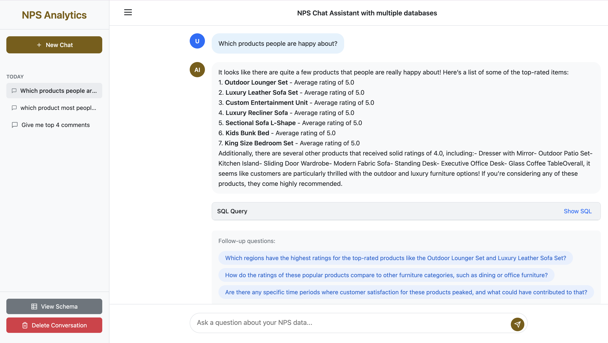

# SQL Chat Agent with Memory

A natural language SQL chat agent that connects to two PostgreSQL databases via Trino, featuring memory capabilities, async processing, and intelligent query correction.

User Interface: 


## Features

- Natural language to SQL conversion using LLM
- Two PostgreSQL databases connected via Trino
- Memory-enabled conversations for context retention
- Automatic query correction using LangGraph
- Follow-up suggestions based on conversation context
- Redis caching for improved performance
- Celery for async task processing
- Flower for monitoring Celery tasks
- Web interface for natural language queries

## Architecture

- **Frontend**: Simple HTML/JavaScript interface with real-time chat functionality
- **Backend**: FastAPI with LangChain and LangGraph for intelligent query processing
- **Query Engine**: Trino for seamless cross-database queries and joins
- **Databases**: Two PostgreSQL instances (NPS data and Product data)
- **Cache**: Redis for conversation memory and query result caching
- **Task Queue**: Celery with Redis broker for async processing
- **Monitoring**: Flower dashboard for task monitoring
- **LLM**: OpenAI GPT-4o-mini (configurable) for natural language understanding

### Key Features

1. **Memory-Enabled Conversations**
   - Redis-backed conversation history
   - Context-aware query processing
   - Session management with 24-hour TTL

2. **Intelligent Query Correction**
   - LangGraph-powered error detection and correction
   - Automatic retry mechanism with up to 3 attempts
   - Schema-aware query validation

3. **Async Task Processing**
   - Celery workers for non-blocking query execution
   - Flower monitoring dashboard
   - Task timeouts and soft limits

4. **Performance Optimization**
   - Query result caching (5-minute TTL)
   - Schema caching (1-hour TTL)
   - Periodic schema refresh tasks

5. **Follow-up Suggestions**
   - Context-aware suggestion generation
   - Based on current query and conversation history
   - Cached for performance

## Prerequisites

- Docker and Docker Compose
- OpenAI API key

## Quick Start

### Prerequisites

Ensure you have the following installed:
- Docker Desktop (version 20.10 or higher)
- Docker Compose (version 2.0 or higher)
- Git

### Setup Instructions

1. **Clone the repository:**
```bash
git clone https://github.com/arun1934/talk-to-multiple-databases
cd sql-chat-agent
```

2. **Create the environment file:**
```bash
cp .env.example .env
```

3. **Edit the `.env` file and add your OpenAI API key:**
```env
OPENAI_API_KEY=your_openai_api_key_here
```

4**Start all services:**
```bash
docker-compose up --build
```

Note: The first build may take several minutes as it downloads all dependencies and builds the containers.

5**Verify all services are running:**
```bash
docker-compose ps
```

You should see all services (app, celery-worker, flower, redis, postgres-nps, postgres-products, trino) in "Up" state.

### Access the Application

Once all services are running, you can access:

- **Web Interface**: http://localhost:8000
  - Main chat interface for querying your NPS data
  - Session-based conversation with memory
  - Real-time query processing

- **Flower Dashboard**: http://localhost:5555
  - Monitor Celery tasks
  - View worker status
  - Track task execution times

- **Trino UI**: http://localhost:8080
  - Monitor query execution
  - View query plans
  - Check system performance

### Stopping the Application

To stop all services:
```bash
docker-compose down
```

To stop and remove all data (including databases):
```bash
docker-compose down -v
```

## Database Schema

### NPS Database (PostgreSQL 1)
- `nps_feedback` table:
  - feedback_id (PK)
  - product_id (FK)
  - rating
  - comment
  - category
  - subcategory
  - region
  - carpenter_name
  - driver_name
  - created_at

### Product Database (PostgreSQL 2)
- `products` table:
  - product_id (PK)
  - product_name
  - description
  - price
  - sku
  - created_at

## Usage

1. Open the web interface at http://localhost:8000
2. Type your question in natural language (e.g., "What's the average rating for furniture deliveries in Dubai?")
3. The system will:
   - Convert your question to SQL
   - Execute the query across both databases
   - Return results in natural language
   - Suggest follow-up questions

## Example Queries

- "Show me all furniture deliveries with ratings below 3 in Dubai"
- "What's the most common complaint about dining tables?"
- "Which carpenter has the highest average rating?"
- "Compare delivery satisfaction between Dubai and Abu Dhabi"

## Development

### Project Structure
```
sql-chat-agent/
├── app/
│   ├── __init__.py
│   ├── main.py
│   ├── tasks.py
│   ├── agents/
│   │   ├── __init__.py
│   │   └── sql_agent.py
│   ├── graphs/
│   │   ├── __init__.py
│   │   └── correction_graph.py
│   ├── services/
│   │   ├── __init__.py
│   │   ├── memory_service.py
│   │   └── suggestion_service.py
├── static/
│   └── index.html
├── sql/
│   ├── init_nps.sql
│   └── init_products.sql
├── trino/
│   └── catalog/
│       ├── nps_db.properties
│       └── products_db.properties
├── docker-compose.yml
├── Dockerfile
├── requirements.txt
├── .env.example
└── README.md
```

### Environment Variables

| Variable | Description | Default |
|----------|-------------|---------|
| OPENAI_API_KEY | OpenAI API key | Required |
| OPENAI_MODEL | OpenAI model to use | gpt-4o-mini |
| REDIS_URL | Redis connection URL | redis://redis:6379/0 |
| CELERY_BROKER_URL | Celery broker URL | redis://redis:6379/1 |
| CELERY_RESULT_BACKEND | Celery result backend | redis://redis:6379/2 |

## Monitoring

- **Flower Dashboard**: Monitor Celery tasks at http://localhost:5555
- **Trino UI**: Monitor queries at http://localhost:8080

## Contributing

1. Fork the repository
2. Create a feature branch
3. Commit your changes
4. Push to the branch
5. Create a Pull Request

## Troubleshooting

### Common Issues

1. **Connection Refused Errors**
   - Ensure all services are up: `docker-compose ps`
   - Check logs: `docker-compose logs [service-name]`
   - Verify network connectivity between containers

2. **Trino Query Failures**
   - Check Trino UI at http://localhost:8080 for query details
   - Verify catalog configurations in `/trino/catalog/`
   - Ensure PostgreSQL databases are initialized properly

3. **Redis Connection Issues**
   - Check Redis is running: `docker-compose ps redis`
   - Verify Redis URL in .env file
   - Test connection: `docker-compose exec redis redis-cli ping`

4. **Celery Worker Issues**
   - Monitor workers in Flower dashboard: http://localhost:5555
   - Check worker logs: `docker-compose logs celery-worker`
   - Verify broker connection in .env file

### Performance Tuning

1. **Query Optimization**
   - Monitor slow queries in Trino UI
   - Add appropriate indexes in PostgreSQL
   - Adjust cache TTL values based on usage patterns

2. **Memory Usage**
   - Configure Redis maxmemory settings
   - Limit conversation history length
   - Implement cache eviction policies

3. **Celery Configuration**
   - Adjust worker concurrency
   - Configure task timeouts
   - Set appropriate prefetch limits

## Security Considerations

1. **API Keys**
   - Never commit .env file to version control
   - Rotate API keys regularly
   - Use environment-specific keys

2. **Database Security**
   - Change default PostgreSQL passwords
   - Limit database access to required services
   - Use read-only users where possible

3. **Network Security**
   - Use internal Docker networks
   - Expose only necessary ports
   - Implement rate limiting on API endpoints

## License

MIT License

## Support

For issues and feature requests, please create an issue in the GitHub repository.

## Acknowledgments

- OpenAI for GPT models
- Anthropic for LangChain and LangGraph frameworks
- Trino team for the distributed SQL query engine
- Redis Labs for the in-memory data store
- Celery team for the distributed task queue
